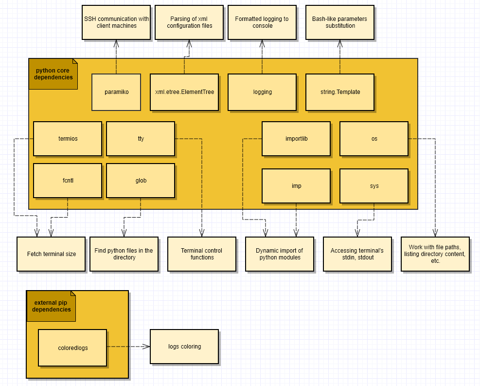
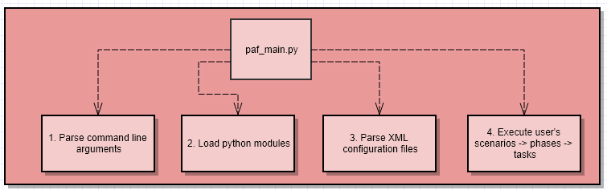

# The PAF framework

## Table of content

- [What is PAF?](#what-is-paf)
- [External dependencies](#external-dependencies)
- [PAF workflow](#paf-workflow)
- [How do I declare the task?](#how-do-I-declare-the-task)
- [The content of the XML configuration file](#the-content-of-the-xml-configuration-file)
- [How to execute PAF scenarios?](#how-to-execute-paf-scenarios)
- [More examples](#more-examples)
- [FAQ](#faq)
- [PAF dependencies](#paf-dependencies)
- [PAF execution workflow](#paf-execution-workflow)

----

## What is PAF?

PAF stands for the "Python automation framework." It is a rather tiny tool for creating and running automation scenarios.

----

## External dependencies

PAF framework relies on python3.

On top of that, it requires the following set of external Python modules:

|Module link|Version|
|---|---|
|[coloredlogs](https://github.com/xolox/python-coloredlogs)|15.0.1+|
|[paramiko](https://docs.paramiko.org/en/stable/)|3.0.0+|

The same list of dependencies can be found [here](./Pipfile). Check the packages section.

To install the dependencies, you can choose one of the following ways:

- Install dependencies on your local system:

  ```bash
  pip install coloredlogs
  pip install paramiko
  ```

  The benefit of this option is that you will not need t to execute any additional commands on your system before running PAF. The con is that your system must have all the mentioned dependencies on it.

- Set up the virtual environment:

  ```bash
  sudo apt-get install -y pipenv
  cd <this_repo_root>
  pipenv install
  pipenv shell
  <use paf>
  ```

  This option benefits your system by preventing it from having additional Python modules installed. The con is that you will need to call "pipenv shell" from the root folder of this repository before running any PAF commands.

That should be enough to proceed.

----

## PAF workflow

1. Place the root paf folder, which contains the framework's implementation, anywhere you want
2. Create a folder inside the root "./paf" folder containing your developed automation scripts. Let's call it "my_scenarios".
3. Create any number of "*.py" files inside "./paf/my_scenarios/" folder, which will contain your automation scripts. You can create any number of Python modules.
4. Develop automation scripts using the "./paf/paf/paf_impl.py" module. Import it into your scripts and develop the tasks. More information on how to do it is [located here](#how-to-declare-the-task)
5. Create an XML file with any name in any location. This file will contain parameters and declarations of scenarios and phases. Let's call it scenarios.xml and place it inside the "./paf/my_scenarios/scenarios.xml" folder.
6. Fill the file with the content. More information on how to do it is [located here](#the-content-of-the-xml-configuration-file)
7. Once both Python code and XML configuration are ready, start the paf tool, feeding your developed artifacts to it. More information on how to do it is [located here](#how-to-execute-paf-scenarios)

----

## How do I declare a task?

A task is an essential building block consisting of one or more commands. You can execute a single task. Besides that, you can group one or more tasks inside a phase and one or more phases inside a scenario. More information on how to do it is [located here](#the-content-of-the-xml-configuration-file).

But, as of now, let's go back to the task. Here is an example of the dummy task, which will call an echo console command:

```python
from paf.paf_impl import logger
from paf.paf_impl import SSHLocalClient

class echo_test(SSHLocalClient):

    def __init__(self):
        super().__init__()
        self.set_name(echo_test.__name__)

    def execute(self):
        output = self.ssh_command_must_succeed("echo ${ECHO_PHRASE}")
        if self.ECHO_PHRASE != output :
            raise Exception(f"Actual output '{output}' is not equal to the expected output '{self.ECHO_PHRASE}'")
        else:
            logger.info(f"Assertion passed. Actual output '{output}' is equal to the expected output '{self.ECHO_PHRASE}'")

```

As you can see, your task is a simple Python class, which inherits from the framework's base classes. The requirements for such a class are relatively simple:

- It should inherit from `paf.paf_impl` - A task or one of its sub-classes ( e.g., paf_impl.SSHLocalClient )
- It optionally can declare and implement the `init` method with no parameters. The framework uses this method to initialize the task before calling 'execute'.
- It should declare and implement the `execute` method without parameters. The framework uses this method to start the execution of your task
- Such a class should implement the `__init__` method, which should:
  - Call the super's init method
  - Pass the name of the task to the 'self.set_name method'

That's all. That simple.

The commands inside your task might be executed using one of the following supported principles:
1. via creating a sub-process on the machine, which is executing the PAF scenario
2. via SSH connection from the machine, which is executing the PAF scenario to one or more target machines

**Note!** If you use SSH communication, make sure that the target machine has an established SSH server.

The API of the paf_impl.The Task class, which the developer of the scenarios should use, consists of the following methods:

----

- subprocess_must_succeed(**cmd**, **timeout** = 0, **expected_return_codes** = [0], **substitute_params** = True, **shell** = True, **exec_mode** = ExecutionMode.COLLECT_DATA, **communication_mode** = CommunicationMode.PIPE_OUTPUT, **avoid_printing_command** = False, **avoid_printing_command_reason** = "The command contains a sensitive information", **avoid_printing_command_output** = False, **avoid_printing_command_output_reason** = "The command output contains a sensitive information", **interaction_mode** = InteractionMode.PROCESS_INPUT)

  This method executes a single command as a subprocess. Its purpose is to intentionally fail in case of error.

  **Parameters:**

  - `cmd` - the command that will be executed. Might be provided in one of the following forms:
    - if the "shell" parameter equals True, the `cmd` parameter can be provided as a string or a list.
    Examples:
      - `self.subprocess_must_succeed("echo 123", shell=True)`
      - `self.subprocess_must_succeed(["echo", "123"], shell=True)`
    - if the "shell" parameter equals False, the `cmd` parameter can be provided as a string. Example:
      - `self.subprocess_must_succeed("echo 123", shell=False)`
      - In this case, providing a list will raise an exception, as splitting a complex bash string into a set of arguments is quite challenging.
  - `timeout` - expected duration of the command in seconds. If exceeded, the exception is raised. Currently, this parameter **is ignored** in this call. To be done.
  - `expected_return_codes` - list of the expected returned codes. By default, it contains only a 0 return code. If the returned code of the cmd is not found in this list, an exception will be raised.
  - `substitute_params` - whether parameters of `cmd` shall be substituted. If set to `true`, bash-like parameters will be substituted. The parameters that take part in substitution are:
    - parameters which are passed from the command line
    - parameters, which are parsed from the XML configuration file
    - parameters, which are injected into the execution environment by the other tasks
    - the fields of the class, which are contained in the `self.__dict__` collection
  - `shell` - if this parameter equals True, the `/bin/bash` sub-shell will be created to execute the command. Only in this mode could the `cmd` be a bash script with pipes, variables, logical operators, etc. Otherwise, the `cmd` must contain a call to one executable with its parameters. Examples:
    - `self.subprocess_must_succeed("cd ~/ && echo "Hello, world!" > ./new_file.txt && cat ./new_file.txt", shell=True)`
    - `self.subprocess_must_succeed("echo 123", shell=False)`
    - `self.subprocess_must_succeed(["echo", "123"], shell=False)`
    - **Note!** In the case of shell mode (`shell=True`), the command will be executed in a subshell that will not receive specific signals from the OS. For example, the interactive console application will not react to changes in terminal size. The PAF framework tries to minimize such side effects. For example, we modify the environment of a running process to contain the size of the terminal once you start the sub-process. Still, you might face some side effects. To avoid them - try to use `shell=False` for interactive applications.
  - `exec_mode` - execution mode. It can contain one of the following values:
    - `ExecutionMode.COLLECT_DATA` - will print data to the terminals `stdout`. Will process stdin. Will collect `stdout` and provide it back to the caller so that the calling code can parse the data
    - `ExecutionMode.PRINT` - will print data to the terminals `stdout`. Will process `stdin`. Will **NOT** collect stdout. The returned output will be an empty string.
    - `ExecutionMode.DEV_NULL` - will **NOT** print data to the terminals `stdout`. Will process `stdin`. Will **NOT** collect `stdout`. The returned output will be an empty string.
    - **Note!** Be aware that when using the `communication_mode = CommunicationMode.USE_PTY` output on `stderr` and `stdout` will be mixed inside the returned output string. There is no way to distinguish between them.
  - `communication_mode` - specifies one of the supported communication modes. Can take one of the following values:
    - `CommunicationMode.USE_PTY` - will redirect the output to a `pseudo-terminal pair`. The executed sub-process will think that it is executed **inside a tty**. Some applications, e.g., the Android repo tool, will print progress only in such a mode and omit it in CommunicationMode.PIPE_OUTPUT.
    - `CommunicationMode.PIPE_OUTPUT` - will pipe all output **without** using the additional PTY. The executed sub-process will think it is **NOT running in a tty**. Some applications, e.g., 'make', will not send console escape sequences in such a case. In this mode, the output would be a build log, which you can put into a file—the one where each next directive will not "overwrite" the previous one.
  - **avoid_printing_command** - this parameter avoids printing the command itself to the console and the log file
  - **avoid_printing_command_reason** - this parameter specifies what to print instead of the command if 'avoid_printing_command' is set to True.
  - **avoid_printing_command_output** - this parameter avoids printing the command output to the console and the log file
  - **avoid_printing_command_output_reason** - this parameter specifies what to print instead of the command's output if 'avoid_printing_command_output' is set to True. **Note!** This string will be printed again instead of every string of the command's output.
  - **interaction_mode** - interaction mode. It can contain one of the following values:
    - `InteractionMode.PROCESS_INPUT` - the user input will be considered
    - `InteractionMode.IGNORE_INPUT` - the user input will be ignored

  **Return value:**
  The string with the output of the `cmd` command's execution.

- **exec_subprocess**(**cmd**, **timeout** = 0, **substitute_params** = True, **shell** = True, **exec_mode** = ExecutionMode.COLLECT_DATA, **communication_mode** = CommunicationMode.PIPE_OUTPUT, **avoid_printing_command** = False, **avoid_printing_command_reason** = "The command contains a sensitive information", **avoid_printing_command_output** = False, **avoid_printing_command_output_reason** = "The command output contains a sensitive information", **interaction_mode** = InteractionMode.PROCESS_INPUT)

  This method executes a single command as a subprocess. It aims to return all details to the client, even if the command fails.

  **Parameters:**

  - **cmd** - the command that will be executed. Might be provided in one of the following forms:
    - if the "shell" parameter equals True, the `cmd` parameter can be provided as a string or a list. Examples:
      - self.subprocess_must_succeed("echo 123", shell=True)
      - self.subprocess_must_succeed(["echo", "123"], shell=True)
    - if the "shell" parameter equals False, the `cmd` parameter can be provided as a string. Example:
      - self.subprocess_must_succeed("echo 123", shell=False)
      In this case, providing a list will raise an exception, as splitting a complex bash string into a set of arguments is quite challenging.
  - **timeout** - expected duration of the command in seconds. If exceeded, the exception is raised. Currently, this parameter **is ignored** in this call. To be done.
  - **substitute_params** - whether cmd parameters should be substituted. If set to true, the substitution of bash-like parameters will take place. The parameters that take part in substitution are:
    - parameters which are passed from the command line
    - parameters, which are parsed from the XML configuration file
    - parameters, which are injected into the execution environment by the other tasks
    - the fields of the class, which are contained in self.\_\_dict\_\_ collection
  - **shell** - if this parameter equals True, the "/bin/bash" sub-shell will be created to execute the command. Only in such a mode could the `cmd` be a bash script with pipes, variables, logical operators, etc. Otherwise, the `cmd` should contain **ONLY** a call to one executable with its parameters. Examples:
    - self.subprocess_must_succeed("cd ~/ && echo "Hello, world!" > ./new_file.txt && cat ./new_file.txt", shell=True)
    - self.subprocess_must_succeed("echo 123", shell=False)
    - self.subprocess_must_succeed(["echo", "123"], shell=False)
    **Note!** In the case of shell mode, the command will be executed in a subshell that will not receive specific signals from the OS. For example, the interactive console application will not react to changes in terminal size. The PAF framework tries to minimize such side effects. For example, we modify the environment of the running process so that it contains the size of the terminal once you start the sub-process. Still, you might face some side effects. To avoid them - try to use shell=False for interactive applications.
  - **exec_mode** - execution mode. It can contain one of the following values:
    - **ExecutionMode.COLLECT_DATA**—will print data to the terminal's stdout. This option will collect stdout and stderr and provide them back to the caller so that the result data can be parsed.
    - **ExecutionMode.PRINT** - will print data to the terminal's stdout. Will process stdin. Will **NOT** collect stdout and stderr. The returned output will be empty strings.
    - **ExecutionMode.DEV_NULL** - will **NOT** print data to the terminal's stdout. Will process stdin. Will **NOT** collect stdout and stderr. The returned output will be empty strings.
    **Note!** Be aware that when using the **communication_mode = CommunicationMode.USE_PTY** the stderr and stdout would be mixed inside the paf_impl.SubprocessCommandOutput.stdout. There is no way to distinguish between them in such a case.
  - **communication_mode** - specifies one of the supported communication modes. Can take one of the following values:
    - CommunicationMode.USE_PTY - will redirect output to a **pseudo-terminal pair**. The executed sub-process will think that it is executed **inside a tty**. Some applications, e.g., the Android repo tool, will print progress only in such a mode and omit it in CommunicationMode.PIPE_OUTPUT.
    - CommunicationMode.PIPE_OUTPUT - will pipe all output **without** using the additional PTY. The executed sub-process will think it is **NOT running in a tty**. Some applications, e.g., 'make', will not send console escape sequences in such a case. In this mode, the output would be a build log, which you can put into a file—the one where each following directive will not "overwrite" the previous one.
  - **avoid_printing_command** - this parameter avoids printing the command itself to the console and the log file
  - **avoid_printing_command_reason** - this parameter specifies what to print instead of the command if 'avoid_printing_command' is set to True.
  - **avoid_printing_command_output** - this parameter avoids printing the command output to the console and the log file
  - **avoid_printing_command_output_reason** - this parameter specifies what to print instead of the command's output if 'avoid_printing_command_output' is set to True. **Note!** This string will be printed again instead of every string of the command's output.
  - **interaction_mode** - interaction mode. It can contain one of the following values:
    - `InteractionMode.PROCESS_INPUT` - the user input will be considered
    - `InteractionMode.IGNORE_INPUT` - the user input will be ignored

  **Returns:**
  An instance of the paf_impl.SubprocessCommandOutput class, which contains the following fields:
  - stdout - output of the command as a string
  - stderr - the content of stderr stream as a string
  - exit_code - exit code of the command

- **ssh_command_must_succeed**(**cmd**, **host**, **user**, **port** = 22, **password** = "", **key_filename** = "", **timeout** = 0, **expected_return_codes** = [0], **substitute_params** = True, **exec_mode** = ExecutionMode.COLLECT_DATA, **jumphost** = None, **passphrase** = None, **avoid_printing_command** = False, **avoid_printing_command_reason** = "The command contains a sensitive information", **avoid_printing_command_output** = False, **avoid_printing_command_output_reason** = "The command output contains a sensitive information", **interaction_mode** = InteractionMode.PROCESS_INPUT)

  This method executes a single command on the SSH server's side. Its purpose is to intentionally fail in case of error.

  **Parameters:**
  - **cmd**—the command sent to the SSH server. A bash-like one-liner command is expected here. It might be rather complex and include pipes, variables, the usage of "and" and "or" operators, etc.
  - **host** - IP address of the target machine on which the command will be executed
  - **user** - the name of the user, which will be used to authenticate to the target machine
  - **port** - the port used for communication with the target machine. By default, an SSH port 22 is used
  - **password** - the password that will be used to authenticate the target machine. It might be empty in case the "key_filename" parameter is provided
  - **key_filename** - one or more paths to the SSH keys, which would be used for authentication to the target system
  - **timeout** - expected duration of the command in seconds. If exceeded, the exception is raised
  - **expected_return_codes** - list of the expected returned codes. By default, it contains only a 0 return code. In case the returned code of the cmd is not found in this list - the exception is raised.
  - **substitute_params** - whether cmd parameters should be substituted. If set to true, the substitution of bash-like parameters will take place. The parameters that take part in substitution are:
    - parameters which are passed from the command line
    - parameters, which are parsed from the XML configuration file
    - parameters, which are injected into the execution environment by the other tasks
    - the fields of the class, which are contained in self.\_\_dict\_\_ collection
  - **exec_mode** - execution mode. It can contain one of the following values:
    - **ExecutionMode.COLLECT_DATA** - will print data to the terminal's stdout. Will process stdin. Will collect stdout and provide it back to the caller so that the calling code can parse the data
    - **ExecutionMode.PRINT** - will print data to the terminal's stdout. Will process stdin. Will **NOT** collect stdout. The returned output will be an empty string.
    - **ExecutionMode.DEV_NULL** - will **NOT** print data to the terminal's stdout. Will process stdin. Will **NOT** collect stdout. The returned output will be an empty string.
  - **jumphost** - an instance of the SSHConnection, which should be used as a proxy to connect to the target system. It can be created or fetched by calling the  SSHConnectionCache.getInstance().find_or_create_connection(...).
  - **passphrase** - the passphrase that should be used to read the private SSH keys.
  - **avoid_printing_command** - this parameter avoids printing the command itself to the console and the log file
  - **avoid_printing_command_reason** - this parameter specifies what to print instead of the command if 'avoid_printing_command' is set to True.
  - **avoid_printing_command_output** - this parameter avoids printing the command output to the console and the log file
  - **avoid_printing_command_output_reason** - this parameter specifies what to print instead of the command's output if 'avoid_printing_command_output' is set to True. **Note!** This string will be printed again instead of every string of the command's output.
  - **interaction_mode** - interaction mode. It can contain one of the following values:
    - `InteractionMode.PROCESS_INPUT` - the user input will be considered
    - `InteractionMode.IGNORE_INPUT` - the user input will be ignored

  **Returns:**
  Command output as a string.

- **exec_ssh_command**(**cmd**, **host**, **user**, **port** = 22, **password** = "", **key_filename** = "", **timeout** = 0, **substitute_params** = True, **exec_mode** = ExecutionMode.COLLECT_DATA, jumphost = None, **passphrase** = None, **avoid_printing_command** = False, **avoid_printing_command_reason** = "The command contains a sensitive information", **avoid_printing_command_output** = False, **avoid_printing_command_output_reason** = "The command output contains a sensitive information", **interaction_mode** = InteractionMode.PROCESS_INPUT)

  This method executes a single command on the SSH server's side. It aims to return all details to the client, even if the command fails.

  **Parameters:**
  - **cmd**—the command sent to the SSH server. A bash-like one-liner command is expected here. It might be rather complex and include pipes, variables, the usage of "and" and "or" operators, etc.
  - **host** - IP address of the target machine on which the command will be executed
  - **user** - the name of the user, which will be used to authenticate to the target machine
  - **port** - the port used for communication with the target machine. By default, an SSH port 22 is used
  - **password** - the password that will be used to authenticate the target machine. It might be empty in case the "key_filename" parameter is provided
  - **key_filename** - one or more paths to the SSH keys, which would be used for authentication to the target system
  - **timeout**—the expected duration of the command in seconds. If exceeded, an exception is raised.
  - **substitute_params** - whether cmd parameters should be substituted. If set to true, the substitution of bash-like parameters will take place. The parameters that take part in substitution are:
    - parameters which are passed from the command line
    - parameters, which are parsed from the XML configuration file
    - parameters, which are injected into the execution environment by the other tasks
    - the fields of the class, which are contained in self.\_\_dict\_\_ collection
  - **exec_mode** - execution mode. It can contain one of the following values:
    - **ExecutionMode.COLLECT_DATA**—will print data to the terminal's stdout. I will collect the stdout and stderr and send them back to the caller so that the result data can be parsed.
    - **ExecutionMode.PRINT** - will print data to the terminal's stdout. Will process stdin. Will **NOT** collect stdout and stderr. The returned output will be empty strings.
    - **ExecutionMode.DEV_NULL** - will **NOT** print data to the terminal's stdout. Will process stdin. Will **NOT** collect stdout and stderr. The returned output will be empty strings.
  - **jumphost** - an instance of the SSHConnection, which should be used as a proxy to connect to the target system. It can be created or fetched by calling the  SSHConnectionCache.getInstance().find_or_create_connection(...).
  - **passphrase** - the passphrase that should be used to read the private SSH keys.
  - **avoid_printing_command** - this parameter avoids printing the command itself to the console and the log file
  - **avoid_printing_command_reason** - this parameter specifies what to print instead of the command if 'avoid_printing_command' is set to True.
  - **avoid_printing_command_output** - this parameter avoids printing the command output to the console and the log file
  - **avoid_printing_command_output_reason** - this parameter specifies what to print instead of the command's output if 'avoid_printing_command_output' is set to True. **Note!** This string will be printed again instead of every string of the command's output.
  - **interaction_mode** - interaction mode. It can contain one of the following values:
    - `InteractionMode.PROCESS_INPUT` - the user input will be considered
    - `InteractionMode.IGNORE_INPUT` - the user input will be ignored

  **Returns:**
  An instance of the paf_impl.SSHCommandOutput class, which contains the following fields:
  - stdout - output of the command as a string
  - stderr - the content of stderr stream as a string
  - exit_code - exit code of the command

----

PAF framework allows you to globally set default values of some of the API's parameters:

- exec_mode
- communication_mode
- interaction_mode

If your automation requires the alternative default parameters that are specified in the API description, you can set your alternative ones using the following methods:

- paf.paf_impl.Config.set_default_execution_mode(val)
- paf.paf_impl.Config.set_default_interaction_mode(val)
- paf.paf_impl.Config.set_default_communication_mode(val)

The most appropriate way to use this feature is to pack these calls into the init section of your Base task:

```
class SomeBaseTask(Task):
    def __init__(self):
        super().__init__()

    def init(self):
        Config.set_default_execution_mode(ExecutionMode.COLLECT_DATA)
        Config.set_default_interaction_mode(InteractionMode.IGNORE_INPUT)
        Config.set_default_communication_mode(CommunicationMode.PIPE_OUTPUT)
```

That will prevent you from specifying those parameters in each PAF API call.

----

## The content of the XML configuration file

The PAF framework is configured using XML files of a specific format. You can feed any number of the XML configuration files to the PAF framework, which it will consider during the execution phase. Use the "-c" "--config" parameter to specify a single path to the configuration file:

```bash
python ./paf/paf_main.py -imd ./paf/my_scenarios -c ./paf/my_scenarios/scenarios.xml -s echo_test
```

Multiple occurrences of the parameter will be considered as various files, which should be applied during the execution. Configuration files are parsed in order of their occurrence in the command line.

Here is what would be the content of the XML file to write our "echo_test" task:

```xml
<paf_config>

    <!--Predefined PAF parameters for connection to the local system-->
    <param name="LOCAL_HOST_IP_ADDRESS" value="127.0.0.1"/>
    <param name="LOCAL_HOST_USER_NAME" value="vladyslav_goncharuk"/>
    <param name="LOCAL_HOST_SYSTEM_SSH_KEY" value="/home/vladyslav_goncharuk/.ssh/id_rsa"/>
    <!-- Better not to use password parameter. Use RSA instead. Still, it is supported. -->
    <!-- <param name="LOCAL_HOST_SYSTEM_PASSWORD" value="xyz"/> -->

    <param name="ECHO_PHRASE" value="Hello, world!"/>
    <phase name="echo_test">
        <task name="my_scenarios.my_scenarios.echo_test"/>
    </phase>
    <scenario name="echo_test">
        <phase name="echo_test"/>
    </scenario>
</paf_config>
```

The following tags are currently supported:

- The root **"paf_config"** tag - is simply the mandatory root tag, which contains all the other tags.

The **"param"** tag specifies the "key-value" pair that can be accessed from within the task. In our case, we have a single parameter called ECHO_PHRASE. You can definitely declare a lot more of them.

  You can access your parameters in multiple ways from the code of your tasks:

    * Via accessing it as a field:
      ```python
      self.ECHO_PHRASE
      ```
      That is possible as all tasks will have all parameters injected into their 'self.\_\_dict\_\_' collection.

    * Via using the bash-like parameters substitution inside the PAF's API:
      ```python
      output = self.ssh_command_must_succeed("echo ${ECHO_PHRASE}")
      ```
      That is possible because of the 'string.Template' abstraction from Python core libraries that we use inside the framework's implementation.

  As you can see above, the "param" tag supports two following mandatory attributes:

  - name - the name of the parameter. Only strings are allowed.
  - value - the value of the parameter. Only strings are allowed.

- The root **"phase"** tag: The phase can be considered a collection of tasks that should be executed sequentially, one after another.

  The phrase tag supports the following mandatory attributes:
    - name - the name of the phase. Used in other places as an access key to the phase.

  The "phase" tag may contain the following sub-tags:
    - task - can be mentioned multiple times, specifying the task name to be executed:
      ```xml
      <phase name="echo_test">
          <task name="my_scenarios.my_scenarios.task_1"/>
          <task name="my_scenarios.my_scenarios.task_2"/>
          <task name="my_scenarios.my_scenarios.task_3"/>
      </phase>
      ```

      Besides that, each "task" inside the "phase" tag can contain an optional "condition" tag, with mandatory "name" and "value" attributes:
      ```xml
      <phase name="echo_test">
          <task name="my_scenarios.my_scenarios.task_1"/>
          <task name="my_scenarios.my_scenarios.task_2">
              <condition name="EXECUTE_TASK_2" value="True"/>
          </task>
          <task name="my_scenarios.my_scenarios.task_3 "/>
      </phase>
      ```
      In the above example, the task "my_scenarios.my_scenarios.task_2" will be executed if the execution environment has a parameter EXECUTE_TASK_2 with the value "True". To have that parameter available, you can:
        - Declare it in the same XML file via the "param" tag
        - Pass it to the PAF using the "-p" "--parameter" console argument:
          ```
          -p EXECUTE_TASK_2=True
          ```
        - Add additional parameters in one of the previous tasks. E.g., the task "my_scenarios.my_scenarios.task_1", depending on its flow, might set the extra parameter:
          ```
          self.set_environment_param("EXECUTE_TASK_2", "True")
          ```

        In such a case, the new parameter would extend the environment, and all following tasks would receive it and be able to use it.

      **Note!** When multiple conditions are met for a single task, the AND logical operator is used. It means that the task will be executed if ALL conditions are met.

- The **"scenario"** tag: The scenario can be considered a collection of phases that should be executed sequentially, one after another.

  The scenario tag supports the following mandatory attributes:
    - name - the name of the scenario

  The "scenario" tag may contain the following sub-tags:
    - phase - can be mentioned multiple times, specifying the phase name to be executed:
      ```xml
          <scenario name="echo_test">
             <phase name="phase_1"/>
             <phase name="phase_2"/>
             <phase name="phase_3"/>
          </scenario>
      ```

      Besides that, each "phase" inside the "scenario" tag can contain a "condition" tag:
      ```xml
          <scenario name="echo_test">
              <phase name="phase_1"/>
              <phase name="phase_2">
                  <condition name="EXECUTE_PHASE_2" value="True"/>
              </phase>
              <phase name="phase_3"/>
          </scenario>
      ```

      The condition logic here is the same as in the root "phase" tag. The phase will be executed if the execution environment has the mentioned parameter with the same value.

----

## How to execute PAF scenarios?

Currently, the tool supports the following set of command line options:

|Parameter|Comment|Allowed number of occurrences|
|---|---|---|
|-t, --task|Task to be executed|Multiple|
|-s, --scenario|Scenario to be executed|Multiple|
|-ph, --phase|Phase to be executed|Multiple|
|-c, --config|Apply this XML configuration file|Multiple|
|-p, --parameter|Add parameter to the execution context|Multiple|
|-imd, --import_module_dir|Load all Python modules from the specified directory recursively. It also adds specified directories to the sys.path|Multiple|
|-ld, --log-dir|Store the output to the specified directory|Last win|

The typical command to execute the PAF scenario would be:

```bash
python ./paf/paf_main.py -imd ./paf/my_scenarios -c ./paf/my_scenarios/scenarios.xml -s echo_test -p ECHO_PHRASE="Overriden echo phrase!" -ld="./"
```

----

## More examples

You can find the example automation project on the [following page](./linux_deployment)

----

## FAQ

**Q:** Does PAF support interactive input?

**A:** PAF supports interactive input for both subprocesses and SSH commands. Please consider the following nuance for the SSH commands: By default, each call of the "ssh_command_must_succeed" and "exec_ssh_command" methods will be interactive.
But between the SSH calls, the channel will be re-opened, which would cause certain limitations, e.g., environment variables are not saved, or the sudo password is not remembered.

**Note!** You can change the default behavior of handling user input by specifying the 'InteractionMode.IGNORE_INPUT' value for the 'interaction_mode' parameter.

**Q:** Why is the sudo password asked on each SSH command execution? Is the connection re-opened on each command?

**A:** No, the connection is not re-opened on each call. So, there are no multiple attempts to log in to your machine. Still, the channel is re-opened on each command, which causes the "sudo password not remembered" use case. It is a limitation of SSH. To reliably get the exit code of each command, we need to use the exec mode of SSH communication. In that mode, the channel is closed after the command execution.

**Q:** Does the framework use any predefined parameters?

**A:** Yes, there are a couple of such parameters:

|Parameter|Comment|
|---|---|
|LOCAL_HOST_IP_ADDRESS|IP address of the local system. It is 127.0.0.1. Still, you might need to run your scenarios on another machine. Due to that, it is possible to configure it.|
|LOCAL_HOST_USER_NAME|User name to be used for authentication to the local system|
|LOCAL_HOST_SYSTEM_SSH_KEY|The full path to the private SSH key, which will be used for authentication to the local system|
|LOCAL_HOST_SYSTEM_PASSWORD|The password used for authentication to the local system. It is better not to use this parameter and prefer the usage of the SSH key|

**Note!** The above-mentioned local host parameters are used by the paf_impl.SSHLocalClient class. If you are not using it - you can avoid specifying them.

----

## PAF dependencies

The diagram below contains the dependencies of the PAF framework on the other Python modules:



----

## PAF execution workflow

The below diagram contains a high-level description of the PAF's execution flow:


